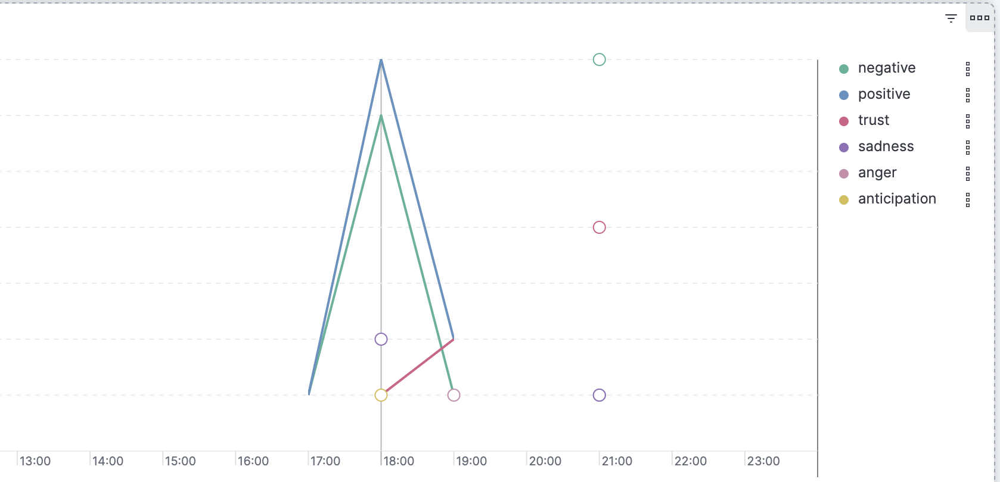

# Indagine sull'Umore Musicale: Sentiment Analysis sui testi delle canzoni di Spotify 

## Introduzione

Questo progetto mira a fornire una visione approfondita delle emozioni espresse nelle canzoni presenti su Spotify, specificatamente sui testi delle canzoni. Con questi dati è possibile visualizzare i gusti musicali nel mondo. Inoltre è stato implementata una versione personale di Spotify (da ora chiamata MySpotify), con possibilità di download e riproduzione offline.

## Problema

La musica evoca una vasta gamma di emozioni, ma comprendere e quantificare questi sentimenti su larga scala è complesso. Con milioni di canzoni disponibili su Spotify, c'è bisogno di strumenti che possano analizzare automaticamente le emozioni espresse nei brani. Questo progetto affronta questa sfida utilizzando le API di Spotify e di Genius per raccogliere dati dalle playlist e applica tecniche di sentiment analysis per determinare le emozioni predominanti.

## Architettura del Sistema

L'infrastruttura del progetto è costruita su tecnologie avanzate, tutte containerizzate tramite Docker per garantire portabilità e facilità di distribuzione.
 

### Componenti Principali

1. **Raccolta Dati con le API di Spotify**:
   - Le API di Spotify e Genius estraggono informazioni dettagliate sulle canzoni nelle playlist pubbliche *Top 50 Global* e *Top 50 Italy*, inclusi titolo, artista, testo e altre metriche.
   Vengono anche inviati i dati riguardanti le canzoni riprodotte dal MySpotify.

2. **Logstash**:
   - Utilizzato per l'ingestione e la trasformazione dei dati raccolti, preparandoli per l'elaborazione successiva.

3. **Apache Kafka**:
   - Funziona come sistema di messaggistica distribuito, trasferendo dati in modo affidabile e scalabile tra i componenti del sistema.

4. **Apache Spark**:
   - Impiegato per l'elaborazione e l'analisi dei dati, utilizzando la libreria NRCLex per eseguire la sentiment analysis sui testi delle canzoni.

5. **Elasticsearch**:
   - Memorizza i risultati dell'analisi di sentiment, permettendo di indicizzare rapidamente i dati e di eseguire query complesse.

6. **Kibana**:
   - Strumento di visualizzazione per creare dashboard interattive e visualizzazioni grafiche dei dati, consentendo agli utenti di esplorare i risultati della sentiment analysis.

## Come Eseguire il Progetto

### Prerequisiti

- Docker
- Docker Compose

### Istruzioni

1. **Clona il Repository**:
   ```bash
   git clone https://github.com/26Marco10/TAP.git
   cd TAP
   ```
2. **Configura le variabili d'ambiente**:
    - Visita il link https://developer.spotify.com/dashboard e crea un nuovo progetto. Copia il Client ID e il Client Secret e aggiungili ai file **.env** all'interno delle cartelle MySpotify e Python.
    - Visita il link https://genius.com/api-clients e copia e incolla Client ID negli stessi file **.env**
3. **Avvia i Servizi**:
    ```bash
   docker-compose up -d --build
   ```
4. **Accedi a MySpotify**:
    - Visita http://localhost:8000 per accedere a MySpotify.


https://github.com/user-attachments/assets/8c8d2189-e25b-40eb-9a44-02260c7e5bb1

      
5. **Accedi a Kibana**:
    - Visita http://localhost:5601 per visualizzare i risultati del sentiment su Kibana.
 
 ## Grafi di Kibana
 
 Kibana mostrerà nella dashboard una serie di grafi. I grafi soprastanti rappresentano i gusti dell'utente che usa MySpotify. Vengono visualizzate le emozioni, i generi e gli artisti più ascoltati. Ci saranno grafi uguali anche per i gusti musicali globali e italiani.
 Inoltre, se si userà MySpotify giornalmente, sarà possibile vedere come variano i propri gusti musicali nel tempo (giornalmente, settimanalmente e mensilmente). Nell'immagine di esempio sottostante è stato usato dalle 17:00 alle 21:00.
 
 

 ## Conclusioni
 Questo progetto combina tecniche avanzate di data engineering e machine learning per analizzare le emozioni nelle canzoni di Spotify. Utilizzando Docker, Logstash, Kafka, Spark, Elasticsearch e Kibana, offriamo uno strumento potente per comprendere le tendenze emotive nella musica.
